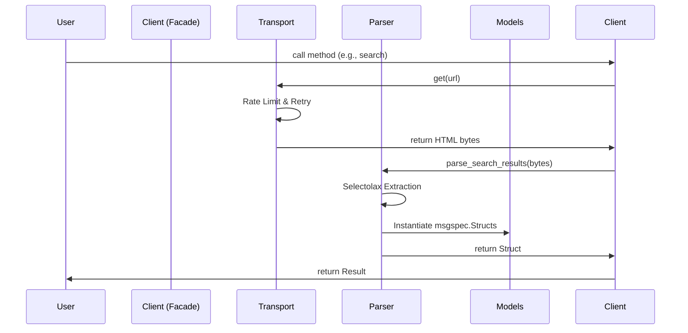

# FitGirl Scraper Code Style & Architecture

This document defines the coding standards, architectural patterns, and procedures for the FitGirl Scraper project.

## 1. Architecture Overview

### 1.1 Core Design Patterns

The project follows a **Modular Mixin Architecture** for the client and a **Domain-Split** pattern for logic and data.

| Component | Responsibility | Pattern |
|-----------|----------------|---------|
| **Client** | Public API Facade | **Mixin Composition**. `FitGirlClient` inherits from `*Mixin` classes in `src/fitgirl/client/`. |
| **Models** | Data Definitions | **Domain Split**. Models are grouped by domain (e.g., `models/torrent.py`, `models/repack.py`). |
| **Parsers** | HTML Extraction | **Pure Functional**. Stateless functions grouped by domain in `parsers/`. |
| **Transport** | HTTP/Network | **Encapsulated Service**. Handles retries, rotation, and browser masquerading. |

### 1.2 Data Flow



## 2. Coding Standards

### 2.1 Typing & Models

We use **Strict Messaging Protocol** definitions.

*   **Models**: Use `msgspec.Struct` for all data transfer objects.
    *   **Must** be `frozen=True` (immutable).
    *   **Must** be `kw_only=True` (explicit instantiation).
    *   **Must** use standard Python types (`tuple` instead of `list` for collections).

    ```python
    # CORRECT
    class GameItem(msgspec.Struct, frozen=True, kw_only=True):
        title: str
        tags: tuple[str, ...] = ()

    # INCORRECT
    @dataclass
    class GameItem:
        title: str
        tags: List[str]
    ```

*   **Type Hinting**:
    *   Use `from __future__ import annotations` in every file.
    *   Use `typing.TYPE_CHECKING` for circular imports.

### 2.2 Asynchronous I/O

The project is **Async-Only**.

*   All Network/Disk I/O must be `await`ed.
*   Blocking HTTP libraries (requests, urllib) are **forbidden**.
*   Blocking File I/O (open) is **forbidden** for large files; use `aiofiles` or thread pool wrappers if necessary.

### 2.3 HTML Parsing

*   **Library**: `selectolax.parser` is mandatory. `BeautifulSoup` is **forbidden**.
*   **Location**: Parsing logic resides **strictly** in `src/fitgirl/parsers/`. The Client layer should never import `selectolax`.
*   **Defensive Coding**: assume markup will change. Handle missing elements gracefully (return `None` or default, do not crash).

### 2.4 Error Handling

*   **Hierarchy**: All exceptions inherit from `FitGirlError` (in `src/fitgirl/exceptions.py`).
*   **Mapping**: The Transport layer must catch low-level errors (`curl_cffi.requests.RequestsError`) and raise `NetworkError`.

## 3. Project Structure

The project uses a modular directory structure.

```text
src/fitgirl/
├── __init__.py           # Exports public API
├── client/               # Client Implementation
│   ├── __init__.py
│   ├── client.py         # Main entrypoint (Mixin composition)
│   ├── _base.py          # Abstract base & context manager
│   ├── _api.py           # API-specific mixins
│   ├── _browse.py        # Browsing mixins
│   └── _urls.py          # URL generation helpers
├── models/               # Data Domain (msgspec)
│   ├── repack.py
│   ├── torrent.py
│   └── ...
├── parsers/              # Logic Domain (selectolax)
│   ├── ipagination.py
│   ├── repack.py
│   └── ...
├── utils/                # Shared Utilities
│   └── tracker.py        # UDP Tracker Scraper
├── exceptions.py         # Global Exception Hierarchy
└── transport.py          # HTTP Transport Layer
```

## 4. Procedures

### 4.1 Adding a New Feature

1.  **Define Data**: Create or update a `msgspec.Struct` in `src/fitgirl/models/<domain>.py`.
2.  **Implement Parser**: Write a pure function in `src/fitgirl/parsers/<domain>.py`.
3.  **Expose API**:
    *   If it fits an existing mixin, add the method there.
    *   If it's a new domain, create `src/fitgirl/client/_<feature>.py`, define a Mixin, and inherit it in `FitGirlClient`.

### 4.2 Linting & Formatting

*   **Tooling**: We use `ruff` (configured in `pyproject.toml`) for linting and formatting.
*   **Rule**: Code must pass `ruff check .` and `ruff format . --check` before merge.

## 5. Documentation

### 5.1 Docstrings

*   **Format**: NumPy Style.
*   **Coverage**: Mandatory for all public classes (`FitGirlClient`, Models) and methods.
*   **Content**: Must include `Parameters`, `Returns`, and `Raises` sections.

### 5.2 GitHub Wiki

The project uses GitHub Wiki for user documentation.

*   **Location**: `wiki/` directory in repo (sync usage).
*   **Structure**:
    *   `Home`: Overview & Architecture.
    *   `Installation`: Setup guide.
    *   `Usage`: Examples.
    *   `API-Reference`: Generated from Mixins.
*   **Policy**: If you add a public feature, you **MUST** update the API Reference.

## 6. Style Cheatsheet

*   **Docstrings**: NumPy Style. Required for all public classes and methods.
*   **Imports**: `isort` style (Standard Lib -> Third Party -> Local application).
*   **Quotes**: Double quotes (`"`) everywhere.
*   **Indent**: 4 spaces.
