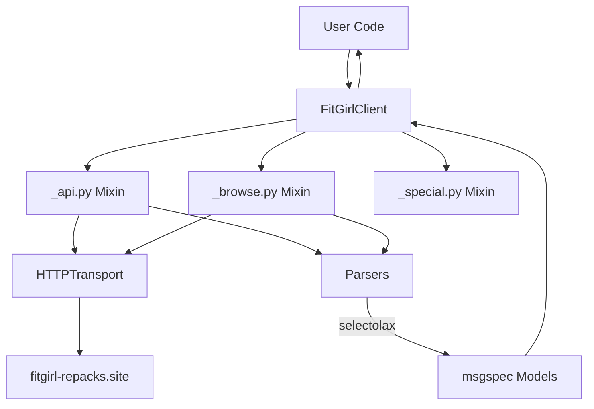

# Welcome to the FitGirl Scraper Wiki

A high-performance, async-first Python library for scraping **FitGirl Repacks**.

> **Note**: This is an unofficial library and is not affiliated with FitGirl Repacks.

## Key Features

*   **Dual Mode Scraping**:
    *   **Public API**: Leverages the hidden WordPress REST API for reliable, structured data.
    *   **HTML Scraping**: Fallback parsing using high-speed `selectolax` for pages without API coverage.
*   **Async First**: Built on `curl_cffi` for impersonating real browsers (TLS fingerprinting) and `asyncio`.
*   **Type Safe**: 100% typed with `msgspec` Structs for validation and IDE support.
*   **Resilient**: Built-in rate limiting, retries, and error handling.

## Architecture

The project follows a modular architecture separating Transport, Logic, and Data.

## Getting Started

*   [Installation](Installation)
*   [Usage Guide](Usage)
*   [API Reference](API-Reference)
